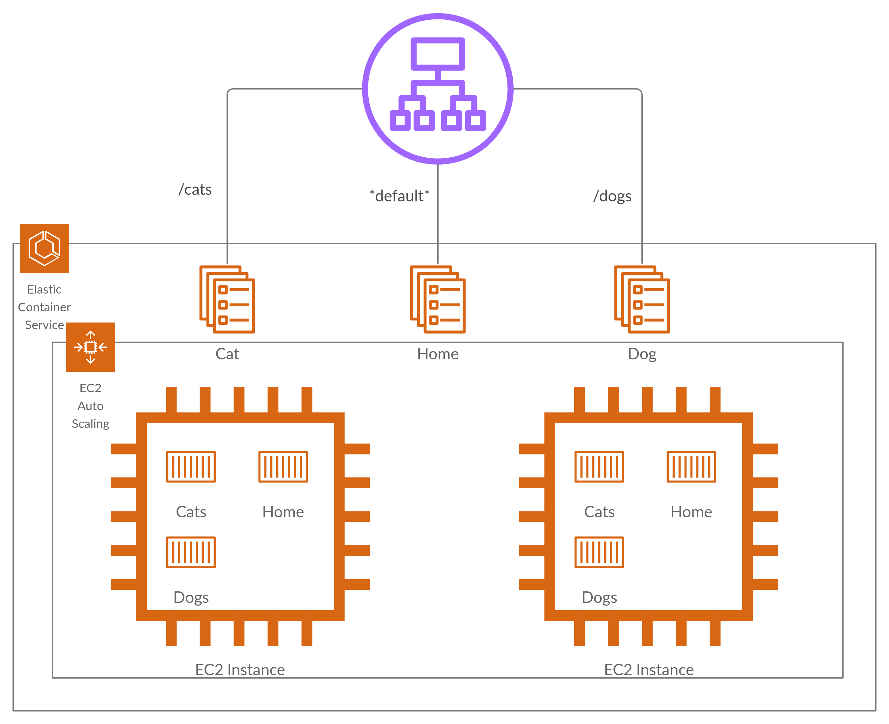

# Sample ECS Deployment

This module deploys the following infrastructure:

Along with VPCs and network ACLs (ommitted see [Network Module](../../modules/infrastructure/network). It also relies on the [ASG and Autoscaling Module](../../modules/infrastructure/asg_and_alb) for the load balancer and EC2 instances.

## ECR Management

This module only holds the cluster definition, service definitions, scaling rules, and Codedeploy application. It has been decided that the ECR repositories are to be managed **outside** of this Terraform configuration. As such, the `create_repos.sh` file must be run to create the requisite repos. This is to support multiple environments sharing repos. All other resources are defined in the modules.

## CodeStar Connections

In line with AWS's release of CodeStar connections, this module also relies on the creation of a [CodeStar Connection](https://docs.aws.amazon.com/codepipeline/latest/userguide/connections-github.html) whether GitHub or Bitbucket. As part of the input variables, users are expected to input the ARN of their CodeStar Connection