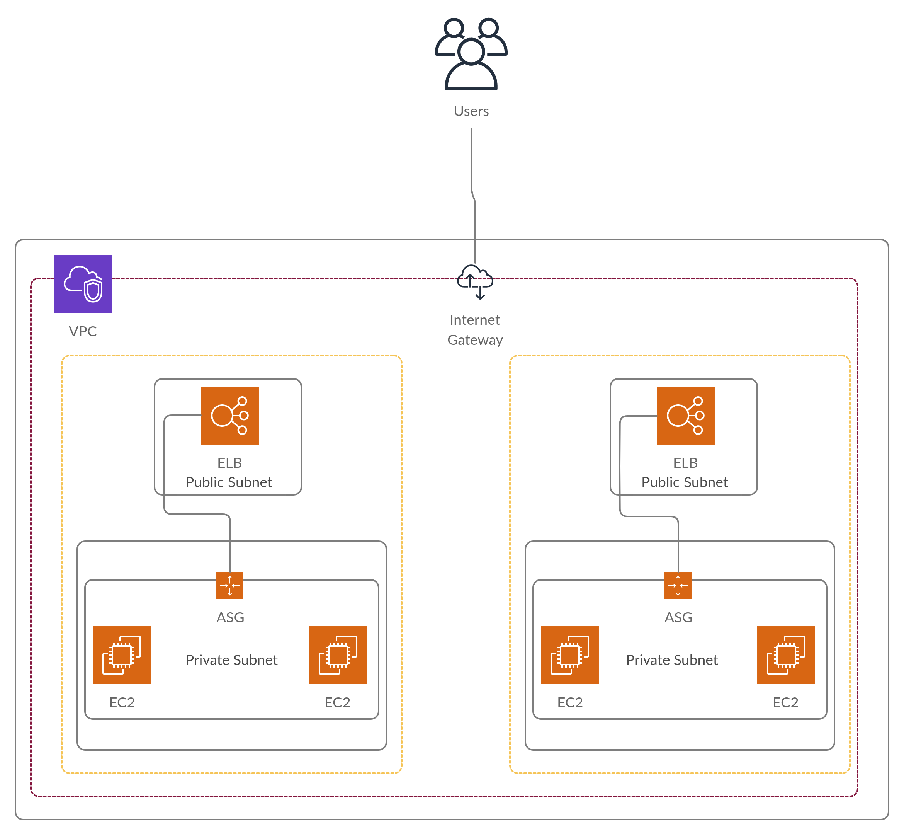

# Sample ECS Deployment

This module deploys the following infrastructure:

It relies on the [network module](../../modules/infrastructure/network) for the network infrastructure and the 
[ASG and Autoscaling Module](../../modules/infrastructure/asg_and_alb) for the load balancer and EC2 instances.

This module only holds the listener rules for the ELB and passes userdata parameters to the [ASG and Autoscaling Module](../../modules/infrastructure/asg_and_alb)
